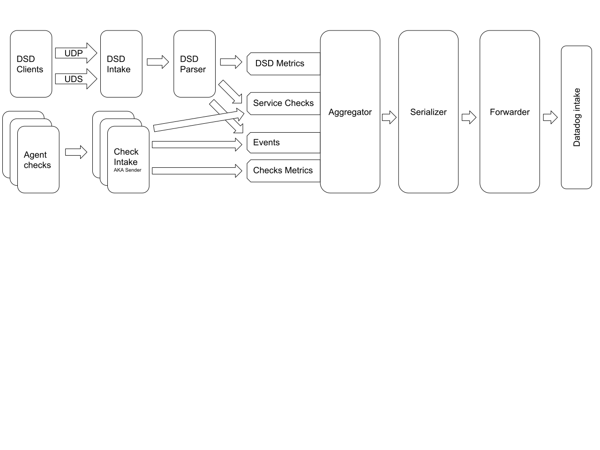

# Agent telemetry

## Metric pipeline

Here is a high level diagram of the agent metric pipeline:

### DogStatsD Intake

The DogStatsD (aka DSD) intake task is to process incoming dogstatsd datagrams sent by dogstatsd clients through UDP and UDS. They are then forwarded to the aggregator.

We collect the following metrics:

#### `datadog.agent.dogstatsd.udp.datagrams_in` - *count*

Total number of datagrams received by the UDP listener.

#### `datadog.agent.dogstatsd.udp.read_errors` - *count*

Total number of errors encountered while calling `UDPConn.ReadFrom`.
Note: this is not the total number of dropped datagrams.

#### `datadog.agent.dogstatsd.uds.datagrams_in` - *count*

Total number of datagrams received by the UDS listener.

#### `datadog.agent.dogstatsd.uds.read_errors` - *count*

Total number of errors encountered while calling `UDSConn.ReadFrom`.
Note: this is not the total number of dropped datagrams.

#### `datadog.agent.dogstatsd.uds.origin_detection_errors` - *count*

Total number of errors encountered while performing origin detection.

#### `datadog.agent.dogstatsd.messages` - *count*

Total number of "messages" extracted from raw datagrams. A message is one line of text from the datagram and could be a metric, a service check, an event or something invalid.

#### `datadog.agent.dogstatsd.errors` - *count*

Total number of errors encountered while parsing "messages".
Note: This total can be supperior to `metric_errors` + `event_errors` + `service_check_errors` because it also includes messages that the parser could not identify.

#### `datadog.agent.dogstatsd.metrics` - *count*

Total number of messages that were identified as metrics. This includes the ones that were not successfully parsed.

#### `datadog.agent.dogstatsd.metrics_errors` - *count*

Total number of errors encountered while parsing a metric message.

#### `datadog.agent.dogstatsd.service_checks` - *count*

Total number of messages that were identified as service checks. This includes the ones that were not successfully parsed.

#### `datadog.agent.dogstatsd.service_checks_errors` - *count*

Total number of errors encoutered while parsing a service check message.

#### `datadog.agent.dogstatsd.events` - *count*

Total number of messages that were identified as events. This includes the ones that were not successfully parsed.

#### `datadog.agent.dogstatsd.events_errors` - *count*

Total number of errors encoutered while parsing an event message.

### Checks Intake

#### `datadog.agent.integration.metrics` - *count* - tagged by *integrationName*

Total number of metrics sent by a specific integration (sum of all the integration instances). This is roughly the total number of call to the following methods of the integration API:
`Gauge()`, `Rate()`, `Count()`, `MonotonicCount()`, `Counter()`, `Histogram()`, `Historate()`.

#### `datadog.agent.integration.service_checks` - *count* - tagged by *integrationName*

Total number of service checks sent by a specific integration (sum of all the integration instances). This is roughly the total number of call to the following method of the integration API: `ServiceCheck`.

#### `datadog.agent.integration.events` - *count* - tagged by *integrationName*

Total number of events sent by a specific integration (sum of all the integration instances). This is roughly the total number of call to the following method of the integration API: `Event`.

### Aggregator

The Aggregator is responsible for receiving metrics, events and service checks and aggregation before passing them to the forwarder. Currently, it has two sources: Integrations and Dogstatsd. It computes rates and histograms and passes them to the Serializer. Every metrics, events and service checks go through the aggregator.

Every 15s the aggregator flushes every metrics, events and service checks it received during that timeframe and sends them to the serializer. During that process, aggregated metrics become series (regular metrics) and sketches (distribution metrics).

#### `datadog.agent.aggregator.metrics` - *count*

Total number of metrics received by the aggregator.

#### `datadog.agent.aggregator.events` - *count*

Total number of events received by the aggregator.

#### `datadog.agent.aggregator.service_checks` - *count*

Total number of service checks received by the aggregator.

#### `datadog.agent.aggregator.series` - *count*

Total number series flushed by the aggregator during the last flush.

#### `datadog.agent.aggregator.sketches` - *count*

Total number sketches flushed by the aggregator during the last flush.

### Serializer

#### `datadog.agent.serializer.series_payloads` - *count*

Total number of series payload generated by the serializer.

#### `datadog.agent.serializer.sketches_payloads` - *count*

Total number of sketches payload generated by the serializer.

#### `datadog.agent.serializer.events_payloads` - *count*

Total number of events payload generated by the serializer.

#### `datadog.agent.serializer.service_checks_payloads` - *count*

Total number of service checks payload generated by the serializer.

#### `datadog.agent.serializer.series_errors` - *count*

Total number of series that the serializer was not able to serialize.

#### `datadog.agent.serializer.sketches_errors` - *count*

Total number of sketches that the serializer was not able to serialize.

#### `datadog.agent.serializer.events_errors` - *count*

Total number of events that the serializer was not able to serialize.

#### `datadog.agent.serializer.service_checks_errors` - *count*

Total number of service checks that the serializer was not able to serialize.

### Forwarder

The forwarder role is to send payloads generated by the serializer to the Datadog intake(s) through HTTP "transactions". It also implements a retry logic so please note that a transaction error does not mean that a payload was dropped and that a single payload may take multiple transactions to be sent. Use `datadog.agent.forwarder.payloads_dropped` to monitor the number of dropped payloads.

#### `datadog.agent.forwarder.payloads_dropped` - *count* - tagged by *domain*

Total number of payload that was dropped by the forwarder (queue full, etc...). The data that it was containing is lost.

#### `datadog.agent.forwarder.series_transactions` - *count* - tagged by *domain*

Total number of transactions with the series endpoint. This includes failed transactions.

#### `datadog.agent.forwarder.sketches_transactions` - *count* - tagged by *domain*

Total number of transactions with the sketches endpoint. This includes failed transactions.

#### `datadog.agent.forwarder.events_transactions` - *count* - tagged by *domain*

Total number of transactions with the events endpoint. This includes failed transactions.

#### `datadog.agent.forwarder.service_checks_transactions` - *count* - tagged by *domain*

Total number of transactions with the service checks endpoint. This includes failed transactions.

#### `datadog.agent.forwarder.metadata_transactions` - *count* - tagged by *domain*

Total number of transactions with the metadata endpoint. This includes failed transactions.

#### `datadog.agent.forwarder.transactions` - *count* - tagged by *domain*

Total number of transactions. This is an alias for the sum of all `datadog.agent.forwarder.*_transactions` This includes failed transactions.

#### `datadog.agent.forwarder.transactions_errors`  - *count* - tagged by *domain* and by *statusCode*

Total number of failed transactions.

## Other

### Integrations loading

#### `datadog.agent.integration.loading_error` - *gauge* - tagged by *integrationName*

Total number of integrations that could not be loaded. This can happen in two scenarios:
- The integration was not recognized by any of the python, jmx or core loaders
- The integration was recognized by a loader but there was an exception during the loading

### Intergations instances

#### `datadog.agent.integration.instances.ok` - *gauge* - tagged by *integrationName*

Total number of integration instances that are in the "OK" state.

#### `datadog.agent.integration.instances.warning` - *gauge* - tagged by *integrationName*

Total number of integration instances that are in the "WARNING" state.

#### `datadog.agent.integration.instances.error` - *gauge* - tagged by *integrationName*

Total number of integration instances that are in the "ERROR" state.

### Agent

#### `datadog.agent.running` - *gauge* - tagged by *agentVersion*

Metric sent on every collection and always equal to one. It can be used to track the number of agent running and their version.

#### `datadog.agent.started` - *count* - tagged by *agentVersion*

Event-like metric sent once at the first agent collection with a delta value of +1. This can help to have a rough idea of the number of agent restarts.
